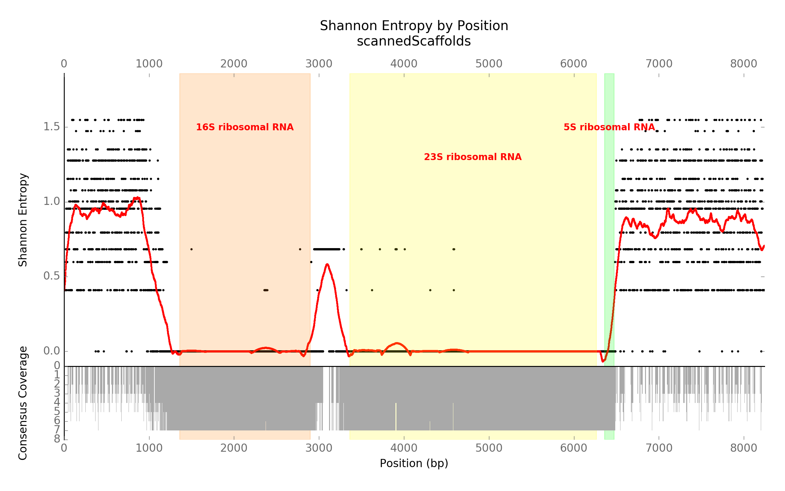
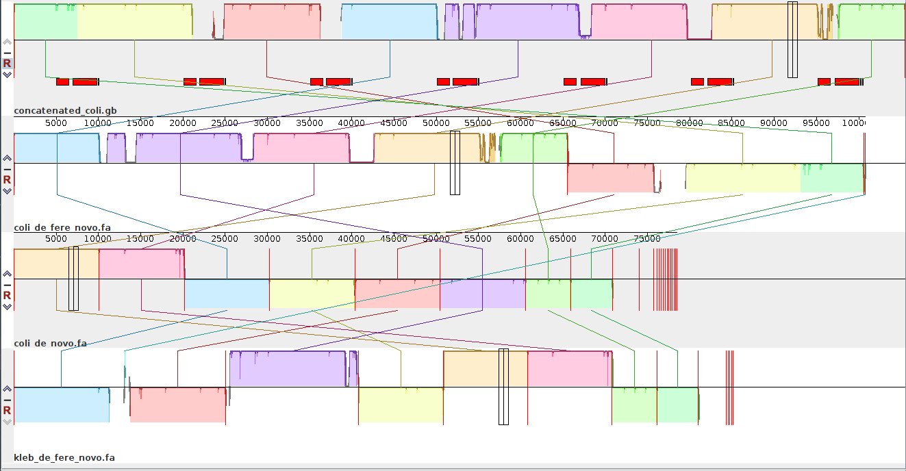

# riboSeed: Leveraging bacterial architecture to assemble across ribosomal regions

We have developed a genome assembly preprocessing scheme, riboSeed, that uses the unique regions flanking the ribosomal coding operons. Please give it a shot and let me know how it goes for you! If you love it, please tweet about it to [#riboSeed](https://twitter.com/search?f=tweets&q=%23riboSeed&src=typd"); if you don't like it, please send me a email instead :)

## Installation
Requires python3.5 or above.  Install with `pip install riboSeed`. For required external tools, see the [README](https://github.com/nickp60/riboSeed/blob/master/README.md#installation).

## Theory

rDNAs, the genomic regions containing the sequences coding for ribosomal RNAs, are often found multiple times in a single genome. Due to how well rDNA is conserved within a taxa, we hypothesized that if the regions flanking the rDNAs are sufficiently unique within a genome, those regions would be able to locate an rDNA within the genome during assembly.

Here, we have extracted all 7 of the rDNA and 1kb flanking regions from the *E. coli Sakai * genome, aligned the sequences, and calculated the coverage and Shannon entropy for the alignments.  This shows a high degree of conservation for the actual coding sequences, but sharply increasing entropy in the flanking regions immediately preceding and following.  This shows that rDNAs, while having nearly identical coding sequences within a genome, have unique flanking regions.

## *De Fere Novo* Assembly

We call our method a *de fere novo* assembly, as we use a subassembly technique to minimize the bias caused by reference choice.  We map the short reads to the reference genome, extract the reads mapping to rDNA (with flanking) regions, and perform subassemblies with [SPAdes](http://bioinf.spbau.ru/spades) to reassemble the rDNA and flanking regions from the reads.  These "long reads" are concatenated together separated with 5kb of N's. The reads are then mapped to the concatenated sequence and and subassembled for several additional iterations.

## Sample Dataset

We generated a simulated genome from the 7 rDNA regions with 5kb flanking regions, and then used [ART (MountRainier-2016-06-05)]("https://www.niehs.nih.gov/research/resources/software/biostatistics/art/") to generated simulated MiSeq reads of various depths.

In this [Mauve](http://darlinglab.org/mauve/mauve.html) visualization, we show (from top to bottom) the reference simulated genome, riboSeed's  *de fere novo* assembly,  *de novo* assembly, and a negative control  *de fere novo* assembly using a *Klebsiella* reference genome.  The results show that with riboSeed's *de fere novo* assembly correctly joins six of the seven rDNA regions to reconstruct the simulated genome with only short reads.  By contrast, the short reads alone failed to bridge any gaps caused by the repeated rDNAs, and the assembly using a poor reference choice only assembled across a single rDNA region. We have run this successfully on many real datasets with positive results

## Conclusions

So what does this mean? We conclude that given short read sequencing data of sufficient (<10x) depth and a taxonomically close reference genome possessing sufficiently unique rDNA flanking regions, riboSeed's *de fere novo* assembly can bridge across gaps in a *de novo* assembly caused by repeated rDNAs.  Its not a silver bullet solving all short read assembly problems, but it reliably addresses a single issue affecting nearly all bacterial genome assemblies.

Futher, when used in conjunction with the other genome finishing tools (namely, in a pipeline such as BugBuilder), riboSeed can result in closed genomes.

## Next Steps

We are currently exploring applications to eukaryotic genome assembly, which can have tens or hundreds of rDNA.
